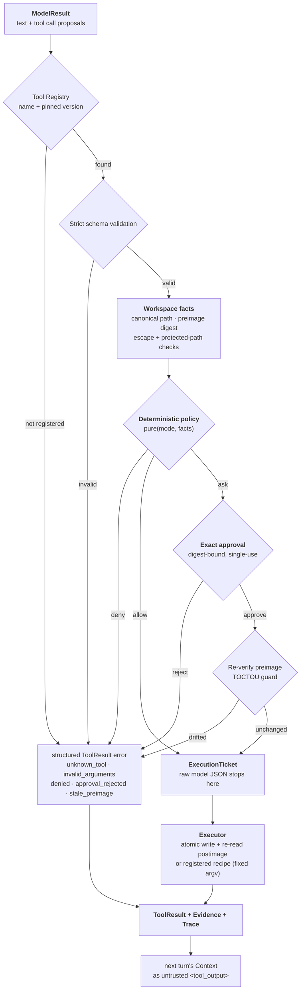

# Haven

**An evidence-driven, replayable, locally scoped TUI coding agent.** The model
proposes actions; the program enforces policy, approval, execution, and success
criteria. Haven is a from-scratch implementation of the machinery behind a
production coding agent (à la Claude Code / Codex CLI) — a bounded agent loop, a
single audited tool-execution channel, precise human approval, durable recovery,
and a reproducible offline eval suite — without leaning on an agent framework.

> Value proposition: a coding agent where a non-deterministic model can only ever
> *propose*; deterministic code owns permission, execution, and the definition of
> success.

## What it does

In a local Git repository you give Haven a bounded coding task. The agent
searches and reads code, proposes a precise edit, waits for your approval, applies
it atomically, runs a registered verification recipe, and shows the streaming
answer, tool trace, diff, test evidence, budgets, and a single stop reason — all
in the terminal. Runs are checkpointed, recoverable, replayable, and gradeable.

```text
Open a local Git repo
  → enter a coding task
  → agent searches, reads, and plans
  → agent proposes a precise edit
  → TUI shows the diff, risk, and one-time approval scope
  → you approve or reject
  → executor applies the change and runs a fixed verification recipe
  → agent may fix failures within a bounded budget
  → TUI shows the final diff, tests, cost, trace, and stop reason
```

## Quick start (offline, no API key)

```bash
uv sync --locked

# Run the deterministic eval suite (ScriptedModel; no network, no key)
uv run haven eval --offline          # 32/32 cases, 0 security violations
uv run python evals/generate_cases.py  # regenerate case JSON if you edit them

# Inspect a stored run / replay its timeline
uv run haven sessions list
uv run haven replay <RUN_ID>

# See exactly where every config value comes from
uv run haven config explain

# See what the model would be shown for a task, and why
uv run haven debug-context "fix the failing parser test"
```

The default provider is OpenAI-compatible. For a live run, set a key and launch
the TUI:

```bash
export HAVEN_API_KEY=sk-...
export HAVEN_MODEL=gpt-4o-mini        # optional; overrides the default
uv run haven verify-provider --yes    # one tiny real request to check connectivity
uv run haven                          # interactive TUI in the current repo
```

Any OpenAI-compatible endpoint works; point `HAVEN_API_KEY_ENV` at whatever
variable the provider conventionally uses:

```bash
export DEEPSEEK_API_KEY=sk-...
export HAVEN_API_KEY_ENV=DEEPSEEK_API_KEY
export HAVEN_BASE_URL=https://api.deepseek.com/v1
export HAVEN_MODEL=deepseek-v4-flash
```

## The single execution channel

Every model-proposed action passes through one pipeline; there is no other path
from a model proposal to a side effect. Each exit on the left produces a
*structured* `ToolResult` that is fed back to the model — never a raw exception.



See `docs/ARCHITECTURE.md` for the layering and state-machine diagrams, and
`docs/SECURITY.md` for the trust model and the guarantees each stage provides.

## What this project demonstrates

- A custom provider adapter, tool-calling layer, and **bounded agent loop** with a
  single, explicit stop reason for every run — not a prebuilt framework.
- Clear separation of **State ≠ Context ≠ Trace ≠ ModelResult**, enforced by an
  import-contract'd layering (`domain → application → ports`, adapters behind a
  single composition root).
- A `search → read → edit → verify → diff` loop over a real repository.
- **Deterministic policy + digest-bound one-time approval + hard workspace
  confinement** over model-proposed side effects, with TOCTOU and stale-approval
  protection.
- An **Evidence Gate**: a run that edited files cannot succeed on the model's word;
  it needs a diff and a passing check recorded *after* the last write, and a
  deterministic review of what it wrote (no committed secrets, conflict markers,
  debugger statements, or silently blanked files).
- **Durable execution**: SQLite checkpoint + append-only event journal, with
  recovery that classifies interrupted effects and *never auto-replays* an
  ambiguous one.
- Streaming, cancellation, budgets (steps/tools/time/tokens/cost), and
  stuck-loop detection.
- A **reproducible offline eval suite** (32 cases across task, robustness,
  security, injection, budget, and recovery) with JSON + Markdown reports and a
  hard security gate.
- **Benefit gates before features**: two capabilities common in comparable
  products (MCP, a model-driven reviewer subagent) were evaluated and
  deliberately *not* built, with the reasoning recorded in ADR 0007.

## Non-goals (v1)

Multi-agent orchestration · RAG/GraphRAG · browser/computer-use/voice/image ·
cloud accounts or remote execution · arbitrary shell (only registered recipes) ·
auto commit/push/PR · multi-provider routing · MCP. These are deliberately out of
scope so the core guarantees can be proven rather than gestured at.

## Command surface

```text
haven [PATH]                         # interactive TUI (default)
haven run GOAL --workspace PATH --json   # headless, read-only (no bypass flag)
haven doctor --workspace PATH        # environment check, no side effects
haven sessions list | show RUN_ID
haven replay RUN_ID                  # pure journal projection, no model/tools
haven resume RUN_ID                  # recovery checks, then TUI
haven reconcile RUN_ID CALL_ID --as confirmed|not_run|abandon
haven export RUN_ID --format jsonl|markdown
haven debug-context GOAL             # what the model would see, and why
haven debug-context --run RUN_ID     # the context recorded at each step
haven eval --offline [--category task,security]
haven eval --live --yes              # explicit, paid, not reproducible
haven verify-provider --yes          # explicit, may incur provider cost
haven config explain --workspace PATH
```

Exit codes are stable: `0` success · `2` usage · `3` policy/permission ·
`4` provider · `5` tool · `6` budget/stopped · `7` recovery required.

## Development

```bash
uv sync --locked
uv run ruff format --check .
uv run ruff check .
uv run mypy src
uv run lint-imports
uv run pytest
```

The CI workflow (`.github/workflows/ci.yml`) runs all of the above plus the
offline eval suite. Tests are fully offline and deterministic: `ScriptedModel`
is the default model, and no test touches the network or a real API key.

## Measured results

All reproducible from a clean checkout with no API key. The numbers below are
generated by `scripts/refresh_metrics.py` and CI fails if they drift:

<!-- BEGIN GENERATED METRICS (scripts/refresh_metrics.py; do not edit by hand) -->

| Metric | Value |
|---|---|
| Automated tests | 508 |
| Line coverage (`src/`) | 88% |
| Source / test size | ~9.7k / ~6.5k lines |
| Typed modules (`mypy --strict`) | 65 |
| Architecture decision records | 13 |
| Offline eval | 33/33 passed, 0 security violations |
| Eval categories | security 12 · task 8 · robustness 6 · injection 3 · budget 2 · recovery 2 |

<!-- END GENERATED METRICS -->

Other fixed guarantees: `ruff`, `mypy --strict`, and `import-linter` (3 layering
contracts) gate every commit; the golden trace is stable across runs and TUI
and headless emit identical traces; the live DeepSeek run is written up in
[`docs/EVAL_LIVE.md`](docs/EVAL_LIVE.md).

`docs/PROJECT_CARD.md` has the one-page summary and trade-off table;
`docs/POSTMORTEM.md` documents two real defects found during development,
including one where the security gate itself was wrong.

## Documentation

| Doc | Contents |
|---|---|
| `docs/ARCHITECTURE.md` | layering, execution-channel, and state-machine diagrams |
| `docs/SECURITY.md` | assets, principals, attack surface, defenses, limitations |
| `docs/EVAL.md` | case design, metrics, offline vs. live eval |
| `docs/EVAL_LIVE.md` | the real-model run: results, and 6 defects only it could find |
| `course/` | a 10-module course that teaches agent engineering using this repo as the textbook |
| `docs/DEMO.md` | 2–3 minute walkthrough script |
| `docs/PROJECT_CARD.md` | one-page summary, measured results, trade-offs |
| `docs/POSTMORTEM.md` | real failures, root causes, regression guards |
| `docs/adr/` | Architecture decision records: scope, tool boundary, evidence gate, durability, eval, planning/budgets, deferred capabilities, prompt-cache ordering, the OS sandbox, compaction, model profiles, process-write attribution, and sandbox scope |
| `docs/ROADMAP.md` | phased plan: what is deliberately not built, and in what order the gaps close |

## Learn from this repo

`course/` is a self-paced course that teaches how to build a production-grade
coding agent by reading and extending this one. Ten modules map to the layers
here — from the provider contract to the execution channel, the Evidence Gate,
durable recovery, and evaluation — each pointing at real files, ADRs, tests, and
the failures found by running against a live model. It runs fully offline (no API
key) and ends with a capstone. Start at [`course/README.md`](course/README.md).

## Design references

Haven is an independent Python implementation. [Morrow](https://github.com/dyxnb22/Morrow)
is one design reference for principles such as a single tool execution channel,
policy-bound approval, and replayable eval — Haven does not fork or copy Morrow
source. See `docs/adr/` for the decisions and trade-offs, and
`Haven_TUI_Coding_Agent_项目计划.md` for the full plan.

## Known limitations

- Child processes run under an OS sandbox (Seatbelt on macOS, Landlock on Linux)
  that blocks writes outside the workspace, reads of `$HOME`, and the network —
  but it is **not** a container or a VM. IPC is open, the Linux network rules
  cover TCP only, and secrets outside `$HOME` stay readable. Haven assumes a
  locally trusted repository and does not claim to safely run
  untrusted/malicious repository code. See [ADR 0009](docs/adr/0009-os-sandbox-and-general-exec.md).
- Token/cost accounting is exact when the provider returns usage and clearly
  marked `estimated` otherwise.
- Single repository, single provider, fixed verification recipes, no automatic Git
  history changes.

## License

TBD
