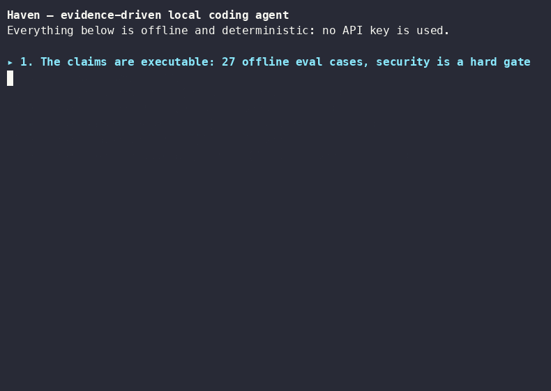
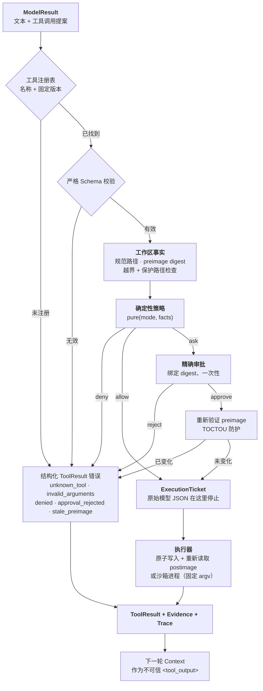

# Haven

[English](README.md) | **中文**

**一个以证据为驱动、可重放、运行范围受限的本地 TUI 编码代理。** 模型只负责提出动作；程序负责执行策略、审批、执行和成功判定。Haven 从零实现了生产级编码代理（类似 Claude Code / Codex CLI）背后的关键机制：有界代理循环、单一且可审计的工具执行通道、精确的人类审批、可持久化恢复，以及可复现的离线评估套件，而且不依赖代理框架。

> 核心价值：非确定性的模型永远只能“提案”；确定性代码掌握权限、执行和成功定义。



*完整离线演示（`./scripts/demo.sh`）包含确定性评估、安全门禁、配置来源、上下文检查和 `doctor`，不需要 API key。交互式 TUI 演示脚本见 `docs/DEMO.md`。*

## 它能做什么

在本地 Git 仓库中给 Haven 一个范围明确的编码任务。代理会搜索并阅读代码，提出精确修改，等待你的审批，以原子方式应用修改，运行已注册的验证配方，并在终端中展示流式回答、工具追踪、diff、测试证据、预算和唯一的停止原因。每次运行都会保存检查点，可恢复、可重放、可评估。

```text
打开本地 Git 仓库
  → 输入编码任务
  → 代理搜索、阅读并规划
  → 代理提出精确修改
  → TUI 展示 diff、风险和一次性审批范围
  → 你批准或拒绝
  → 执行器应用修改并运行固定验证配方
  → 代理可以在有界预算内修复失败
  → TUI 展示最终 diff、测试、成本、追踪和停止原因
```

## 快速开始（离线，不需要 API key）

```bash
uv sync --locked

# 运行确定性评估套件（ScriptedModel；无网络、无需密钥）
uv run haven eval --offline          # 全部用例通过，0 个安全违规
uv run python evals/generate_cases.py  # 修改用例后重新生成 JSON

# 查看已保存的运行 / 重放时间线
uv run haven sessions list
uv run haven replay <RUN_ID>

# 查看每个配置值的来源
uv run haven config explain

# 查看模型会看到什么上下文，以及原因
uv run haven debug-context "fix the failing parser test"
```

默认 Provider 兼容 OpenAI。进行真实运行时，设置密钥并启动 TUI：

```bash
export HAVEN_API_KEY=sk-...
export HAVEN_MODEL=gpt-4o-mini        # 可选；覆盖默认模型
uv run haven verify-provider --yes    # 发送一次很小的真实请求检查连通性
uv run haven                          # 在当前仓库启动交互式 TUI
```

任何支持流式传输和工具调用的 OpenAI-compatible Chat Completions endpoint 都可以配置。将 `HAVEN_API_KEY_ENV` 指向该 Provider 使用的环境变量即可：

```bash
export DEEPSEEK_API_KEY=sk-...
export HAVEN_API_KEY_ENV=DEEPSEEK_API_KEY
export HAVEN_BASE_URL=https://api.deepseek.com/v1
export HAVEN_MODEL=deepseek-v4-flash
```

## 单一执行通道

模型提出的每个动作都会经过同一条流水线；不存在从模型提案直达副作用的其他路径。左侧的每个出口都会产生结构化 `ToolResult`，再反馈给模型，而不是把原始异常直接交回去。



分层和状态机见 [`docs/ARCHITECTURE.md`](docs/ARCHITECTURE.md)，信任模型和每个阶段的保证见 [`docs/SECURITY.md`](docs/SECURITY.md)。

## 这个项目展示了什么

- 自定义 Provider 适配器、工具调用层和**有界代理循环**，每次运行都有一个明确的停止原因，而不是依赖预制框架。
- 清晰区分 **State ≠ Context ≠ Trace ≠ ModelResult**，并通过导入契约强制分层（`domain → application → ports`，适配器只能在唯一组合根后面）。
- 在真实仓库中实现 `search → read → edit → verify → diff` 循环。
- **确定性策略 + 绑定 digest 的一次性审批**、文件工具的严格路径限制，以及模型提议的通用 exec 必须经过原生沙箱，并带有 TOCTOU 和过期审批保护。
- **Evidence Gate**：修改文件的运行不能只凭模型一句话成功；必须在最后一次写入之后记录 diff 和通过的检查，并确定性审查写入内容（不能有提交的密钥、冲突标记、调试语句或被静默清空的文件）。只读运行没有可核对的产物，因此由预算和停止原因约束，而不是验证成功；这个边界记录在 ADR 0003 中。
- **持久化执行**：SQLite 检查点 + 追加式事件日志；恢复流程会分类中断的副作用，无法判断时绝不自动重放。
- 流式响应、取消、预算（步骤 / 工具 / 时间 / token / 成本）和卡死循环检测。
- 可复现的离线评估套件，覆盖任务、健壮性、安全、注入、预算和恢复用例，并有硬安全门禁。
- **先有收益门禁，再加功能**：MCP、模型驱动的 reviewer subagent、planner/FSM、subagent 编排和完整 LSP 集成等能力，已根据实测失败数据评估并有意不实现；理由记录在 ADR 0007，以及实时评估阶段之后的 ADR 0023 中。

## 非目标（v1）

多代理编排 · RAG/GraphRAG · 浏览器 / computer-use / 语音 / 图片 · 云账号或远程执行 · 不受限制的 shell（`repo.exec` 只接受 argv；显式 shell 解释器必须审批且仍处于沙箱中）· 自动 commit/push/PR · 多 Provider 路由 · MCP。这样可以证明核心保证，而不是只做概念性承诺。

## 命令面

<!-- BEGIN CLI COMMAND SURFACE -->

```text
haven                                # 在当前目录启动交互式 TUI
haven tui [PATH]                     # 在指定工作区启动交互式 TUI
haven init --workspace PATH [--accept]   # 一步初始化：环境摘要 + 配方发现
haven run GOAL --workspace PATH      # 无头模式；默认只读
haven run GOAL --write --approval-policy reject|trusted-recipe|all [--jsonl] [--events F]
haven continue RUN_ID FOLLOW_UP      # 保留上下文继续运行
haven discover --workspace PATH [--accept]   # 建议（或保存）.haven.toml 配方
haven doctor --workspace PATH        # 环境检查，不产生副作用
haven gc [--keep N] [--older-than-days D] [--yes]   # 清理旧运行（默认只预览）
haven sessions list | show RUN_ID
haven replay RUN_ID                  # 纯日志投影，不调用模型或工具
haven resume RUN_ID                  # 恢复检查后进入 TUI
haven rewind RUN_ID                  # 撤销已完成运行的文件修改（失败即关闭）
haven reconcile RUN_ID CALL_ID --as confirmed|not_run|abandon
haven export RUN_ID --format jsonl|markdown
haven debug-context GOAL             # 模型会看到什么，以及原因
haven debug-context --run RUN_ID     # 查看每一步记录的上下文
haven eval --offline [--category task,security]
haven eval --live --yes              # 明确、有费用、不可复现
haven verify-provider --yes          # 明确操作，可能产生 Provider 费用
haven config explain --workspace PATH
```

<!-- END CLI COMMAND SURFACE -->

TUI 中的 `/help`、`/budget`、`/context`、`/sessions`、`/fork`、`/rewind`、`/diff`、`/export` 和 `/quit` 提供交互控制。`@path` 文件提及会让代理通过 `repo.read` 访问文件，不会绕过工具边界；运行期间输入的文字会排队到下一轮，而不是打断当前轮。

退出码稳定：`0` 成功 · `2` 用法错误 · `3` 策略 / 权限 · `4` Provider · `5` 工具 · `6` 预算 / 停止 · `7` 需要恢复。

## 开发

```bash
uv sync --locked
uv run python scripts/gates.py --mode fast   # 格式、lint、类型、分层、文档、说明
uv run python scripts/gates.py               # CI 强制的全部检查
uv run python scripts/gates.py --list        # 检查图及其依赖
```

检查项及其依赖只在 `scripts/gates.py` 中声明一次，CI 运行同一张图（`--mode full`），因此本地命令和 CI 步骤不会漂移。测试完全离线且确定性：默认模型是 `ScriptedModel`，没有测试访问网络或真实 API key。

## 测量结果

所有结果都可以在不使用 API key 的干净 checkout 中复现。下面的数字由 `scripts/refresh_metrics.py` 生成，发生漂移时 CI 会失败：

<!-- BEGIN GENERATED METRICS (scripts/refresh_metrics.py; do not edit by hand) -->

| 指标 | 数值 |
|---|---|
| 自动化测试 | 885 |
| 行覆盖率（`src/`） | 89% |
| 源码 / 测试规模 | 约 16.6k / 约 11.9k 行 |
| 类型检查模块（`mypy --strict`） | 102 |
| 架构决策记录 | 30 |
| 离线评估 | 39/39 通过，0 个安全违规 |
| 评估类别 | security 16 · task 10 · robustness 6 · injection 3 · budget 2 · recovery 2 |
| 实时真实仓库套件（deepseek-v4-flash） | 修复后 75/79（31/31 + 9/9 + 5/5 + 20/20 + 9/13 + 1/1）；0 个安全违规——原始运行和根因见 docs/EVAL_LIVE.md |
| 同版本完整重跑 | 一次不间断运行中 61/65（失败归因见 docs/EVAL_LIVE.md） |

<!-- END GENERATED METRICS -->

其他固定保证：`ruff`、`mypy --strict` 和 `import-linter`（3 个分层契约）会阻止不合格提交；golden trace 在运行之间稳定，TUI 和无头模式产生相同 trace；实时 DeepSeek 运行记录在 [`docs/EVAL_LIVE.md`](docs/EVAL_LIVE.md)。

[`docs/PROJECT_CARD.md`](docs/PROJECT_CARD.md) 是一页式摘要和权衡表；[`docs/POSTMORTEM.md`](docs/POSTMORTEM.md) 记录开发期间发现的三个真实缺陷，其中一个是安全门禁本身的错误。

## 文档

| 文档 | 内容 |
|---|---|
| [`docs/ARCHITECTURE.md`](docs/ARCHITECTURE.md) | 分层、执行通道和状态机图 |
| [`docs/SECURITY.md`](docs/SECURITY.md) | 资产、主体、攻击面、防御和限制 |
| [`docs/EVAL.md`](docs/EVAL.md) | 用例设计、指标、离线与实时评估 |
| [`docs/EVAL_LIVE.md`](docs/EVAL_LIVE.md) | 每次真实模型测量及其暴露的缺陷 |
| [`course/`](course/README.md) | 一个推导模块加十个分层模块，教你从这个仓库学习代理工程 |
| [`docs/DEMO.md`](docs/DEMO.md) | 2–3 分钟演示脚本 |
| [`docs/PROJECT_CARD.md`](docs/PROJECT_CARD.md) | 一页式摘要、测量结果和权衡 |
| [`docs/RESUME.zh-CN.md`](docs/RESUME.zh-CN.md) | 可直接拼接进简历的中文项目条目和面试讲述提纲 |
| [`docs/DESIGN_QA.md`](docs/DESIGN_QA.md) | 每个关键设计决策的质询记录 |
| [`docs/POSTMORTEM.md`](docs/POSTMORTEM.md) | 真实失败、根因和回归防护 |
| [`docs/DEFENSIVE_PATTERNS.md`](docs/DEFENSIVE_PATTERNS.md) | 编写策略、边界、门禁或 Provider 代码前应阅读的防御规则 |
| [`docs/LEARNING.md`](docs/LEARNING.md) | 阅读顺序、事实层级，以及当前文档与历史计划的边界 |
| [`docs/PROJECT_DIAGRAMS.md`](docs/PROJECT_DIAGRAMS.md) | 架构、业务流程、安全和恢复的学习图谱 |
| [`docs/ADR_INDEX.md`](docs/ADR_INDEX.md) | 生效中的决策导航、历史裁决和新增 ADR 准入规则 |
| [`docs/notes/`](docs/notes/) | 轻量级决策笔记 |
| [`docs/adr/`](docs/adr/) | 不就地改写的架构决策历史记录 |
| [`docs/ROADMAP.md`](docs/ROADMAP.md)（及 ROADMAP2/3） | 已执行的改进计划和构建顺序记录 |

## 从这个仓库学习

`course/` 是一套自学课程，带你通过阅读和扩展这个仓库来构建生产级编码代理。课程从“从零推导”开始，之后依次讲 Provider 契约、工具执行通道、Evidence Gate、持久化恢复和评估；所有模块都指向真实文件、ADR、测试和实时模型失败案例。课程完全离线运行，最后以结业项目收尾。从 [`course/README.md`](course/README.md) 开始。

## 设计参考

Haven 是独立实现的 Python 项目。[Morrow](https://github.com/dyxnb22/Morrow) 是单一工具执行通道、策略绑定审批和可重放评估等原则的设计参考；Haven 没有 fork 或复制 Morrow 源码。设计决定与权衡见 `docs/adr/`，历史原始计划见 `Haven_TUI_Coding_Agent_项目计划.md`。

## 已知限制

- 模型提议的 `repo.exec` 需要 Seatbelt（macOS）或 Landlock（Linux），在工作区只读、不能读取 `$HOME`、不能访问网络（Landlock 覆盖 TCP；UDP/DNS 仍是 Linux 的已知缺口）。注册的 `repo.check` 使用可写工作区配置，并可通过已审阅配方选择网络；审批卡会再次展示实际命令、工作区写权限、网络权限和额外可读目录。没有沙箱后端的平台仍会在本地信任仓库假设下运行检查，但会拒绝 `repo.exec`。这不是容器或虚拟机：IPC 是开放的，`$HOME` 之外的密钥可能仍可读取。见 [ADR 0009](docs/adr/0009-os-sandbox-and-general-exec.md)、[ADR 0013](docs/adr/0013-sandbox-scope-exec-vs-check.md) 和 [ADR 0030](docs/adr/0030-exact-effect-attribution.md)。
- Provider 返回 usage 时 token / 成本统计是精确的，否则会清楚标记为 `estimated`。
- 单仓库、单 Provider、固定验证配方，不自动修改 Git 历史。

## 许可证

[MIT](LICENSE) © 2026 diaoyuxuan。
