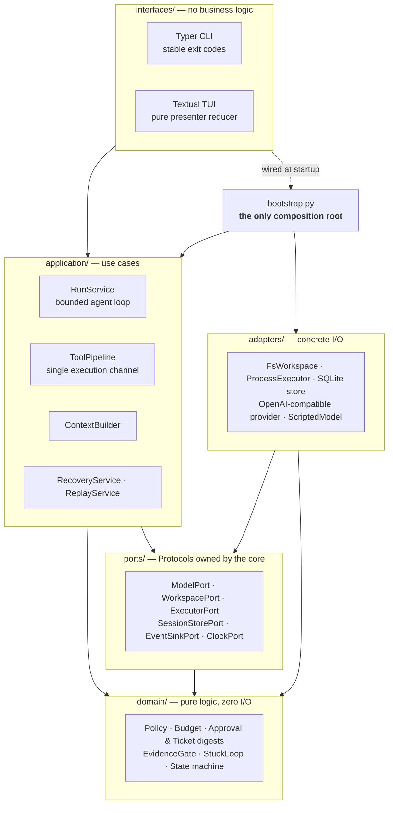
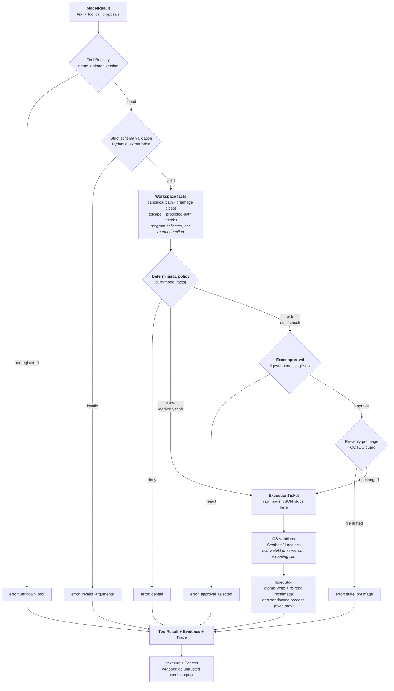
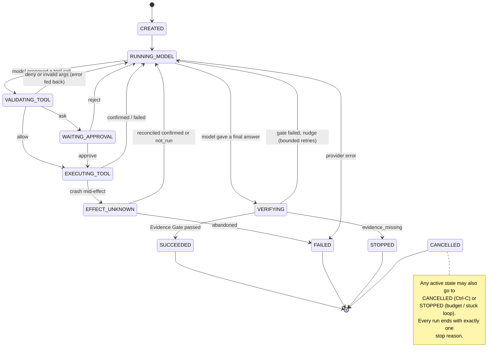

# Haven Architecture

## System context

Haven runs inside a user-trusted local Git workspace. The model proposes text and
tool calls; Haven validates, authorizes, executes, records evidence, and decides
when a run succeeds or stops. The user, the TUI, and the model are all treated as
*proposers*; only deterministic program code inside the single execution channel
is an *authority*.

## Layering and dependency direction



`domain` never imports outward; `application` never imports an adapter;
`interfaces` never imports an adapter directly. `import-linter` enforces all
three, so a reverse import fails CI rather than review.

- `domain/` — pure logic: enums, budgets, policy, approval/ticket digests,
  evidence gate, stuck-loop detection, the run state machine. No I/O, no
  framework imports.
- `contracts/` — strict Pydantic v2 DTOs for every boundary (model wire-neutral
  types, tool args/results, application events, versioned checkpoint).
- `ports/` — `typing.Protocol` interfaces owned by the core: `ModelPort`,
  `WorkspacePort`, `ExecutorPort`, `SessionStorePort`, `EventSinkPort`,
  `ClockPort`.
- `application/` — use cases: `ContextBuilder`, `ToolPipeline`, `RunService`
  (the agent loop), `RecoveryService`, `ReplayService`, `EventEmitter`. Depends
  only on `domain`, `ports`, and `contracts`.
- `adapters/` — concrete implementations: filesystem workspace, subprocess
  executor, OpenAI-compatible + scripted providers, SQLite/in-memory session
  stores, Git baseline.
- `interfaces/` — Typer CLI and Textual TUI. Never import adapters directly.
- `bootstrap.py` — the only composition root; it is the single place that knows
  both concrete adapters and use cases. Tests substitute `ScriptedModel` and
  `MemorySessionStore` here.

These rules are enforced by `import-linter` contracts in `pyproject.toml`, so a
reverse import (e.g. `domain` importing Textual) fails CI.

### Four things that are deliberately not the same

| Concept | Owner | What it is |
|---|---|---|
| **State** | `application.RunContext` | what the run knows: transcript, usage, evidence ledger, files read |
| **Context** | `application.ContextBuilder` | what the model sees *this turn*: selected, budget-fitted, trust-labelled |
| **ModelResult** | `contracts.model` | what the model just returned: text + tool-call proposals + usage |
| **Trace** | `contracts.events` journal | what the journal recorded: the append-only, replayable event stream |

Keeping these separate is why prompt injection in a file cannot change
permissions (it is untrusted Context, not State/policy), and why a replayed run
reconstructs the same screen (Trace drives the same presenter reducer).

## Trust boundaries

| Component | Role | Must not |
|---|---|---|
| User | Goal, approval, cancel, resume | Bypass deterministic policy via natural language |
| TUI / CLI | UserIntent in, ApplicationEvent out | Execute tools or own permission rules |
| AgentLoop (`RunService`) | Orchestrate model and next step | Read files, spawn processes, or write persistence directly |
| Model | Propose text or tool calls | Approve itself or cause side effects directly |
| ToolPipeline | Registry, schema, facts, policy, approval, execution | Skip any gate |
| Workspace / Executor | Authorized I/O only | Accept raw model JSON |
| EvidenceGate | Decide success from diff + checks | Accept model text as sole success evidence |
| SessionStore | Events, checkpoints, approvals, executions | Store secrets or unbounded raw content |

## Tool surface

Eleven tools, deliberately: enough to complete a real repository task, small
enough that every one has an explicit policy classification. A unit test asserts
that the registry and the policy's tool sets stay in sync and that no
side-effecting tool is ever auto-allowed, so adding a tool cannot create an
unclassified path. `repo.exec` is the single, explicitly pinned exception: a
command classified as obviously read-only is auto-allowed, and a test asserts
that exactly one class enjoys that exception.

| Tool | Policy (interactive / read-only) | Key constraints |
|---|---|---|
| `repo.list` | allow / allow | workspace-confined, entry cap |
| `repo.search` | allow / allow | ripgrep when available (honours `.gitignore`), Python fallback; result, line, and byte caps |
| `repo.read` | allow / allow | regular UTF-8 files, line and byte caps; records the digest that later binds an edit |
| `repo.edit` | ask / deny | existing files only, preimage-bound, unique match unless `occurrence` or `replace_all` is set |
| `repo.create` | ask / deny | new paths only — fails on anything that exists, so it can never blank an unread file |
| `repo.delete` | ask / deny | existing files only, content pinned at approval so a concurrent change fails closed |
| `repo.move` | ask / deny | rename/move; fails if the destination exists, so it never silently overwrites |
| `repo.diff` | allow / allow | shows only what *this run* changed, including created files |
| `repo.exec` | allow if classified read-only, else ask / deny | argv array only (no shell string), OS sandbox, no network, `$HOME` unreadable; output is never evidence |
| `repo.check` | ask / deny | registered recipe ids only, fixed argv, scrubbed env, timeout, bounded output, same sandbox |
| `task.plan` | allow / allow | touches only run state; no path, no external effect (`STATE_TOOLS`) |

### Why the plan is a tool and not a message

`task.plan` writes an ordered step list into `RunContext` — **State**, not the
transcript. `ContextBuilder` re-renders it into every subsequent request, so
budget-driven compaction (which drops the oldest tool outputs first) can never
discard the agent's plan. It is emitted as `plan.updated` for the **Trace**, and
persisted in `CheckpointV1` so a resumed run still knows what it was doing.

### What happens when the transcript outgrows the budget

The oldest tool outputs are dropped and replaced by one program-assembled
`run_digest` — which files were read, which edits landed, which checks ran and
with what exit code. The model is never asked to summarize, because a summary
it wrote could invent permission-shaped facts. The digest is derived from the
dropped messages rather than from live state, which keeps it byte-identical
between compaction events and so keeps the prefix cacheable (ADR 0008, ADR
0010). It is labelled **trusted** and therefore carries only program-made
metadata: no file content, no model prose.

The rendered plan is labelled **untrusted**, because the model wrote its text.
See ADR 0006 for the benefit gate and ADR 0007 for the capabilities that were
evaluated and deliberately not built.

## Single execution channel

Every model-proposed action takes this path, and there is no other path from a
proposal to a side effect. Every exit on the left is a *structured* `ToolResult`
fed back to the model — never an exception, never a silent failure.



Invariants:

- The executor accepts only a program-minted `ExecutionTicket`, never model JSON.
- Every child process is confined by the OS. Where no backend exists, `repo.exec`
  is denied rather than run unconfined, and no configuration can override that
  (ADR 0009).
- Approvals bind workspace + tool + canonical args + preimage + preview digests;
  any drift invalidates them, and each is consumed at most once (a conditional
  SQL `UPDATE`).
- Policy `deny` can never be turned into `allow` by user text or repo content.
- A run that wrote files needs a diff **and** a passing check recorded after the
  last write before it may be reported as succeeded.

## Run state machine



Illegal transitions raise in `domain.transitions.transition()`, so a state bug
fails loudly rather than corrupting a run.

## Runtime event flow (TUI)

```text
Input/Key → UserIntent → Textual Worker → RunService coroutine
  → EventEmitter.emit(ApplicationEvent)
      → SessionStore.append_event (authoritative) OR transient (streaming delta)
      → bounded asyncio.Queue (transient deltas dropped under pressure;
        authoritative events apply backpressure)
  → presenter.reduce(state, envelope)  [pure]
  → widgets render read-only PresenterState
```

The presenter is a pure reducer (`PresenterState + Event → PresenterState`). The
headless CLI and replay consume the *same* event stream and, for replay, the same
reducer — which is why TUI, CLI, and replay stay consistent by construction.

## Persistence

SQLite (WAL) in the platform data directory (`HAVEN_DATA_DIR` overrides it),
always outside any workspace so `repo.*` tools can never reach it.

| Table | Purpose |
|---|---|
| `runs` | authoritative per-run summary |
| `events` | append-only trace / replay (`(run_id, seq)` unique, per-event digest) |
| `checkpoints` | fast-resume snapshots (checksum + schema version, fail-closed) |
| `approvals` | digest-bound, single-use consumption via conditional UPDATE |
| `executions` | side-effect journal for crash reconciliation |
| `schema_meta` | fail-closed schema versioning |

Large content (diffs, file originals) is content-addressed in an artifact store;
events keep only digests and bounded summaries.

See `docs/SECURITY.md`, `docs/EVAL.md`, `docs/DEMO.md`, the ADRs in `docs/adr/`,
and `Haven_TUI_Coding_Agent_项目计划.md` for the full plan, budgets, and matrix.
