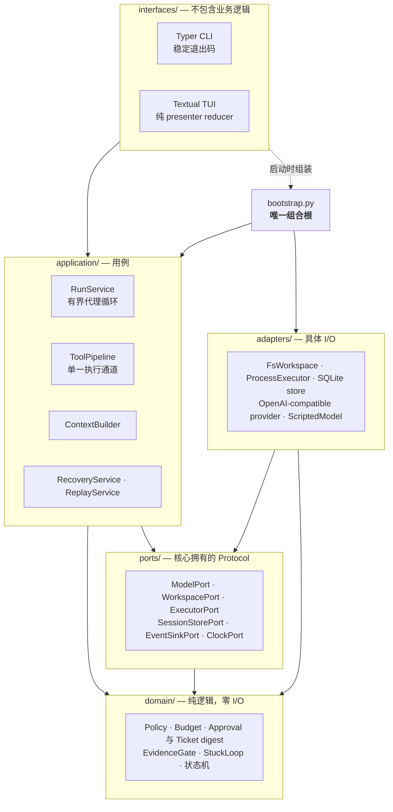
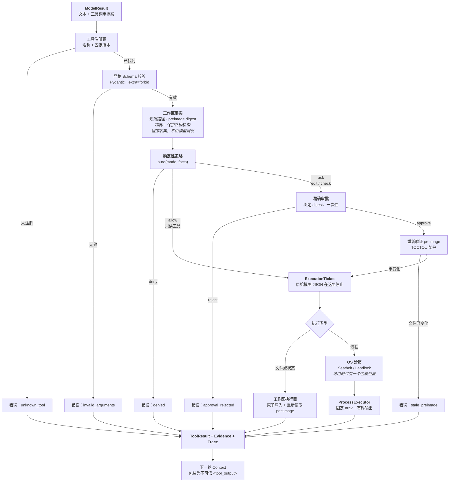
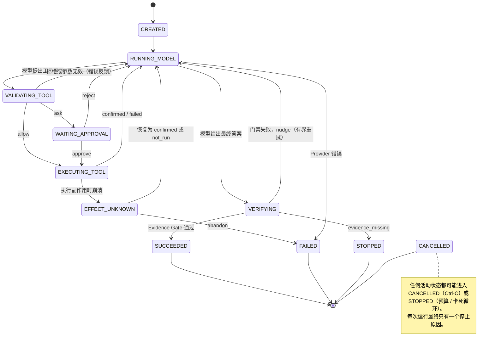

# Haven 架构

[English](ARCHITECTURE.md) | **中文**

## 系统上下文

Haven 运行在用户信任的本地 Git 工作区中。模型提出文本和工具调用；Haven 负责校验、授权、执行、记录证据，并判断一次运行何时成功或停止。用户、TUI 和模型都被视为“提案者”；只有单一执行通道中的确定性程序代码才是“权威”。

## 分层与依赖方向



`domain` 永远不能向外导入；`application` 不能导入适配器；`interfaces` 不能直接导入适配器。`import-linter` 强制执行这三条规则，因此反向导入会在 CI 中失败，而不是等到代码评审时才发现。

- `domain/` — 纯业务逻辑：枚举、预算、策略、审批 / ticket digest、证据门禁、卡死循环检测和运行状态机。不访问 I/O，也不导入框架。
- `contracts/` — 所有边界上的严格 Pydantic v2 DTO，包括与模型线协议无关的类型、工具参数 / 结果、应用事件和版本化检查点。
- `ports/` — 核心拥有的 `typing.Protocol` 接口：`ModelPort`、`WorkspacePort`、`ExecutorPort`、`SandboxLauncher`、`SessionStorePort`、`EventSinkPort`、`ClockPort`。
- `application/` — 用例：`ContextBuilder`、`ToolPipeline`、`RunService`（代理循环）、`RecoveryService`、`ReplayService`、`EventEmitter`。只依赖 `domain`、`ports` 和 `contracts`。
- `adapters/` — 具体实现：文件系统工作区、子进程执行器、操作系统沙箱启动器（macOS 的 Seatbelt、Linux 的 Landlock）、OpenAI-compatible 与 scripted Provider、SQLite / 内存 session store、Git baseline，以及单写者工作区租约（ADR 0020）。
- `interfaces/` — Typer CLI 和 Textual TUI，不能直接导入适配器。
- `bootstrap.py` — 唯一组合根，是唯一同时了解具体适配器和用例的地方。测试在这里替换成 `ScriptedModel` 和 `MemorySessionStore`。

这些规则由 `pyproject.toml` 中的 `import-linter` 契约强制执行，因此类似 `domain` 导入 Textual 的反向依赖会直接让 CI 失败。

### 四个刻意区分的概念

| 概念 | 所属 | 含义 |
|---|---|---|
| **State** | `application.RunContext` | 运行知道的内容：transcript、usage、证据账本、已读取文件 |
| **Context** | `application.ContextBuilder` | 本轮模型看到的内容：经过选择、预算适配并标注信任级别 |
| **ModelResult** | `contracts.model` | 模型刚返回的内容：文本、工具调用提案和 usage |
| **Trace** | `contracts.events` 日志 | 日志记录的内容：追加式、可重放的事件流 |

正因为这四者分离，文件中的 prompt injection 才不能改变权限（它是不可信的 Context，不是 State 或 policy）；重放运行时也能还原相同画面（Trace 驱动同一个 presenter reducer）。

## 信任边界

| 组件 | 角色 | 不得做什么 |
|---|---|---|
| 用户 | 提交目标、审批、取消、恢复 | 不能用自然语言绕过确定性策略 |
| TUI / CLI | 输入 `UserIntent`，输出 `ApplicationEvent` | 不能执行工具或拥有权限规则 |
| AgentLoop（`RunService`） | 编排模型和下一步 | 不能直接读文件、启动进程或写持久化数据 |
| 模型 | 提出文本或工具调用 | 不能自我审批或直接产生副作用 |
| ToolPipeline | 注册表、Schema、事实、策略、审批、执行 | 不能跳过任何门禁 |
| Workspace / Executor | 只执行已授权的 I/O | 不能接受原始模型 JSON |
| EvidenceGate | 根据 diff + checks 决定成功 | 不能只接受模型文本作为成功证据 |
| SessionStore | 保存事件、检查点、审批和执行记录 | 不能保存密钥或无限量原始内容 |

## 工具面

项目刻意只保留十二个工具：足以完成真实仓库任务，又足够小，可以为每个工具指定明确的策略分类。单元测试会检查注册表与策略工具集合同步，并保证任何副作用工具都不能被自动允许，因此新增工具不会悄悄创建未分类路径。`repo.exec` 是唯一明确固定的例外：明显只读且操作数仍在工作区内的命令可以自动允许，测试也会断言只有这一类拥有该例外。

<!-- BEGIN GENERATED TOOL TABLE (scripts/gen_tool_table.py; do not edit by hand) -->

| 工具 | 分类 | 交互策略 | 只读模式 | 关键约束 |
|---|---|---|---|---|
| `repo.apply_patch` | effect | ask | deny | 多文件事务：先模拟，一次审批绑定所有文件的 preimage，带日志原子应用并可回滚（ADR 0019） |
| `repo.check` | effect | ask | deny | 只允许注册的 recipe id、固定 argv、清理后的环境、超时和有界输出；工作区可写，用户配置可以选择网络 |
| `repo.create` | effect | ask | deny | 只能创建新路径；已存在时失败，因此不会清空文件 |
| `repo.delete` | effect | ask | deny | 只能删除已存在文件；审批时固定内容，并发变化会失败 |
| `repo.diff` | read-only | allow | allow | 只显示本次运行的改动，包括新建文件 |
| `repo.edit` | effect | ask | deny | 只能修改已有文件，绑定 preimage；除非设置 `occurrence` 或 `replace_all`，否则必须唯一匹配 |
| `repo.exec` | exec | ask | deny | 只接受 argv 数组，不接受 shell 字符串；工作区只读、无网络、不可读 `$HOME` 的 OS 沙箱；输出永远不是证据 |
| `repo.list` | read-only | allow | allow | 限定在工作区内，限制条目数量 |
| `repo.move` | effect | ask | deny | 重命名 / 移动；目标存在时失败，因此不会静默覆盖 |
| `repo.read` | read-only | allow | allow | 只读普通 UTF-8 文件，限制行数和字节数；记录稍后绑定 edit 的 digest |
| `repo.search` | read-only | allow | allow | 优先使用 ripgrep（遵守 `.gitignore`），否则使用 Python fallback；限制结果、行数和字节数 |
| `task.plan` | state | allow | allow | 只修改运行状态；没有路径，也没有外部副作用 |

*这些决定由 `evaluate_policy` 对一个格式正确且无害的提案本身计算；工作区外路径、保护路径或没有沙箱等硬拒绝会在所有模式中覆盖普通决定。*

<!-- END GENERATED TOOL TABLE -->

`repo.exec` 还会自动允许明显只读、且操作数仍位于工作区内的命令（ADR 0026）；其他命令都必须先询问。

### 为什么 plan 是工具，而不是消息

`task.plan` 把有序步骤写入 `RunContext`，它属于 **State**，而不是 transcript。`ContextBuilder` 会在后续每次请求中重新渲染计划，因此预算驱动的压缩（优先丢弃最旧的工具输出）不会丢掉代理的计划。它会以 `plan.updated` 事件写入 **Trace**，并保存进 `CheckpointV1`，所以恢复运行时仍然知道自己在做什么。

### transcript 超出预算时会发生什么

最旧的工具输出会被丢弃，并由程序组装的一条 `run_digest` 替代：读过哪些文件、应用了哪些编辑、运行了哪些检查及其退出码。程序不会要求模型自己总结，因为模型写出的摘要可能伪造类似权限的事实。digest 从被丢弃的消息派生，而不是从实时状态生成，因此在不同压缩事件之间保持字节级一致，并能保持前缀可缓存（ADR 0008、ADR 0010）。它标记为 **trusted**，只携带程序生成的元数据，不包含文件内容或模型原话。

渲染出来的 plan 标记为 **untrusted**，因为它的文本由模型写入。收益门禁和未构建能力见 ADR 0006、0007。

## 单一执行通道

每个模型提议的动作都经过以下路径；不存在从提案到副作用的其他路径。左侧的每个出口都是反馈给模型的结构化 `ToolResult`，不会直接抛出异常，也不会静默失败。



不变量：

- 执行器只接受程序创建的 `ExecutionTicket`，永远不接受模型 JSON。
- 文件操作直接使用工作区适配器；OS 沙箱阶段只服务于进程工具。在支持的后端上，每个子进程都在执行器处被包装。没有后端时，模型提议的 `repo.exec` 会被拒绝而不是不受限运行，配置也不能覆盖这一点；用户注册的 `repo.check` 仍可在本地信任假设下运行（ADR 0009/0013）。
- 审批绑定工作区、工具、规范参数、preimage 和预览 digest；任何漂移都会使审批失效，每个审批最多消费一次（通过条件 SQL `UPDATE`）。
- `deny` 永远不能被用户文本或仓库内容变成 `allow`。
- 修改过文件的运行，必须在最后一次写入之后记录 diff 并通过 check，才能报告成功。

## 运行状态机



非法转换会在 `domain.transitions.transition()` 中抛出异常，因此状态错误会尽早暴露，而不会悄悄污染运行记录。

## 运行时事件流（TUI）

```text
输入/按键 → UserIntent → Textual Worker → RunService 协程
  → EventEmitter.emit(ApplicationEvent)
      → SessionStore.append_event（权威事件）或 transient（流式增量）
      → 有界 asyncio.Queue（压力下丢弃 transient；权威事件施加背压）
  → presenter.reduce(state, envelope)  [纯函数]
  → widgets 渲染只读的 PresenterState
```

Presenter 是纯 reducer（`PresenterState + Event → PresenterState`）。无头 CLI 和 replay 消费同一事件流；replay 还消费同一个 reducer，所以 TUI、CLI 和 replay 能通过构造保持一致。

## 持久化

SQLite（WAL）位于平台数据目录中（`HAVEN_DATA_DIR` 可以覆盖），始终在工作区之外，因此 `repo.*` 工具无法访问它。

| 表 | 用途 |
|---|---|
| `runs` | 每次运行的权威摘要 |
| `events` | 追加式 trace / replay（`(run_id, seq)` 唯一，保存每个事件 digest） |
| `checkpoints` | 快速恢复快照（校验和 + schema 版本，失败即关闭） |
| `approvals` | 绑定 digest，通过条件 UPDATE 一次性消费 |
| `executions` | 崩溃恢复所需的副作用日志 |
| `schema_meta` | 失败即关闭的 schema 版本管理 |

大型内容（diff、文件原文）会以内容寻址方式保存到 artifact store；事件只保存 digest 和有界摘要。

当前阅读顺序见 [`docs/SECURITY.md`](SECURITY.md)、[`docs/EVAL.md`](EVAL.md)、[`docs/DEMO.md`](DEMO.md)、`docs/adr/` 和 [`docs/LEARNING.md`](LEARNING.md)。原始项目计划只作为历史输入保留，不是当前行为契约。
