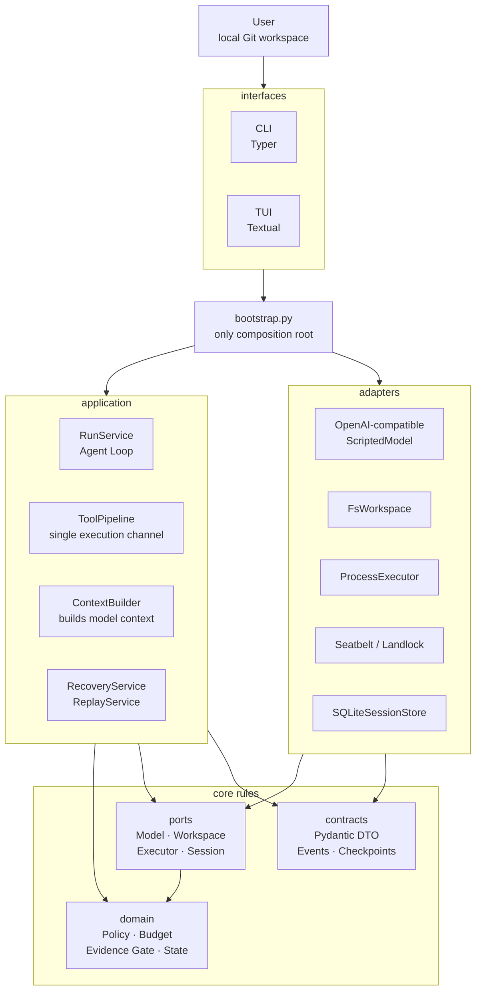
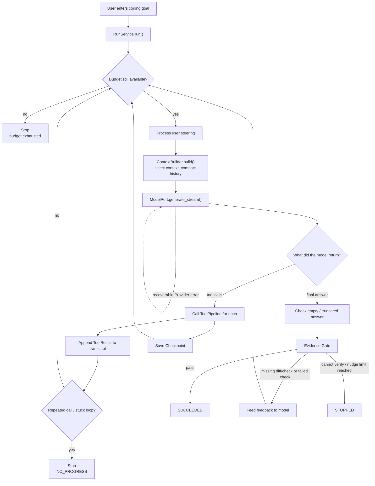
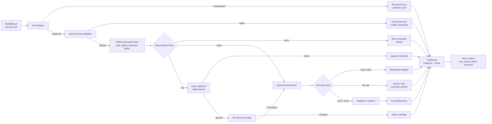
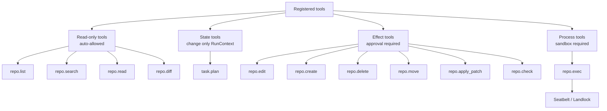
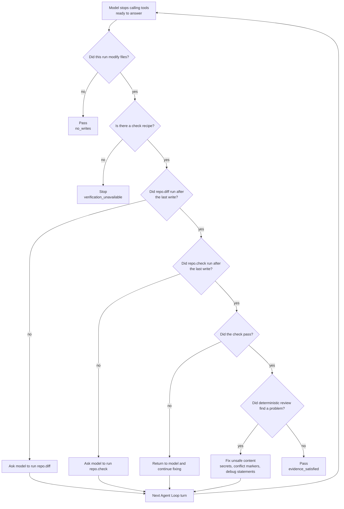
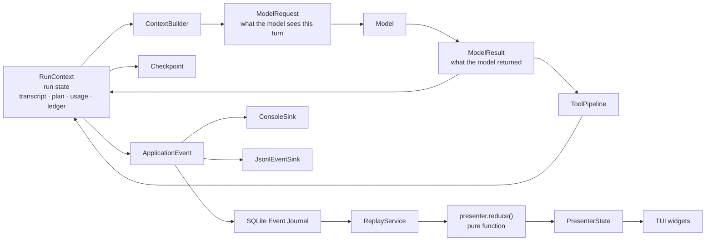
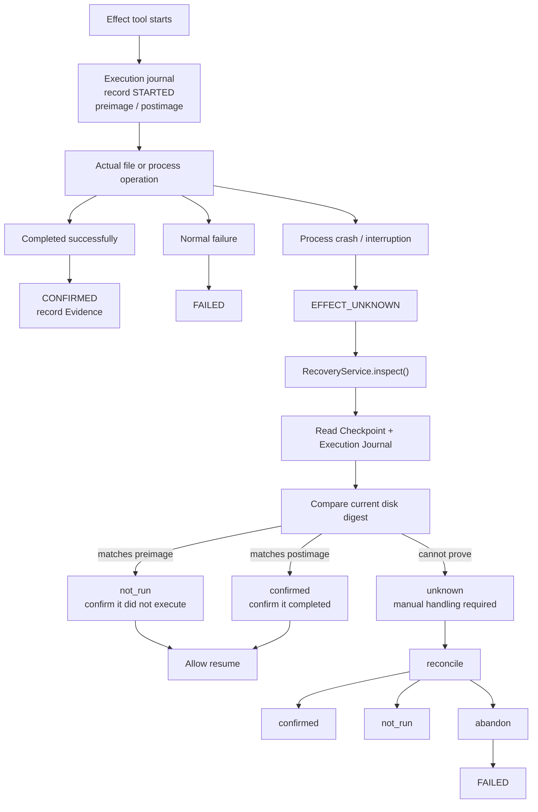

# Haven Project Learning Diagrams

**English** | [中文](PROJECT_DIAGRAMS.md)

This document explains Haven's architecture, runtime flow, security boundaries, Evidence Gate, persistence and recovery, and recommended learning path through diagrams.

A useful one-sentence model of Haven is:

> The model proposes; deterministic program code owns permission, execution, records, verification and stopping.

The diagrams follow the current source. Main references:

- [`src/haven/bootstrap.py`](../src/haven/bootstrap.py)
- [`src/haven/application/run_service.py`](../src/haven/application/run_service.py)
- [`src/haven/application/tool_pipeline.py`](../src/haven/application/tool_pipeline.py)
- [`src/haven/domain/evidence.py`](../src/haven/domain/evidence.py)
- [`src/haven/application/context_builder.py`](../src/haven/application/context_builder.py)
- [`src/haven/adapters/sqlite_session.py`](../src/haven/adapters/sqlite_session.py)
- [`src/haven/application/recovery_service.py`](../src/haven/application/recovery_service.py)
- [`docs/ARCHITECTURE.md`](ARCHITECTURE.md)

## 1. Overall architecture



Key takeaways:

- `domain/` contains the pure business rules and cannot access files, databases or networks.
- `application/` orchestrates the business flow without depending on concrete adapters.
- `adapters/` are where the model, filesystem, processes, SQLite and OS sandbox are actually accessed.
- `bootstrap.py` assembles abstractions and concrete implementations.
- `interfaces/` only receives user input and presents results.

## 2. Core business flow



A normal modification task looks like:

```text
Understand the task
  → search files
  → read files
  → plan the change
  → propose the edit
  → request approval
  → apply the edit
  → inspect the diff
  → run tests
  → continue fixing from failures
  → pass the Evidence Gate
  → finish the run
```

## 3. Single tool execution channel

This is the project's most important security flow.



The key principle is:

> The executor does not accept raw model JSON; it accepts only a program-created `ExecutionTicket`.

## 4. Tool categories



Important details:

- `repo.exec` output is observation, not test evidence.
- Only a registered `repo.check` can verify a modification.
- In `read_only` mode, file edits, checks and `repo.exec` are denied.
- Even user approval cannot bypass hard denials such as path escape, protected paths or a missing sandbox.

## 5. Evidence Gate



After a file write, success requires:

```text
the change exists
  + a diff exists after the last write
  + a check ran after the last write
  + the check passed
  + deterministic diff review passed
```

Therefore, “I fixed it” in the model's answer cannot make the task succeed.

## 6. State, Context, ModelResult and Trace



| Concept | Meaning |
|---|---|
| `State` | State the program knows during the run |
| `Context` | Content actually sent to the model this turn |
| `ModelResult` | Content just returned by the model |
| `Trace` | Event history recorded by the program |

Especially important:

- Historical tool output is marked untrusted when it enters Context.
- `AGENTS.md` content in the repository is also treated as untrusted data.
- Program-generated budget, digest and Evidence are trusted state.
- TUI, CLI and Replay consume the same event stream.

## 7. Persistence and crash recovery



SQLite mainly stores:

```text
runs          run summary
events        append-only event journal
checkpoints   fast-resume snapshots
approvals     digest-bound, single-use approvals
executions    effect execution journal
artifacts     original file content
```

The core recovery rule is:

> When Haven cannot prove whether an effect completed, it never replays it automatically.

## 8. Recommended learning order

Read in this order instead of starting with the TUI:

1. [`README.md`](../README.md): understand the product goal and guarantees.
2. [`bootstrap.py`](../src/haven/bootstrap.py): see how modules are assembled.
3. [`run_service.py`](../src/haven/application/run_service.py): understand the Agent Loop.
4. [`tool_pipeline.py`](../src/haven/application/tool_pipeline.py): understand how proposals become safe execution.
5. `domain/`: focus on `policy.py`, `evidence.py`, `budget.py`, `transitions.py`, `approval.py` and `ticket.py`.
6. `ports/` and `adapters/`: understand dependency inversion and concrete implementations.
7. `events.py`, `emitter.py` and `sqlite_session.py`: understand events, logs and recovery.
8. `interfaces/tui/`: finally see how the interface consumes events rather than executing logic.
9. [`course/00-from-scratch.md`](../course/00-from-scratch.md) through `course/capstone.md`: review the system with the guided course.

Recommended commands to try:

```bash
uv run haven eval --offline
uv run haven debug-context "fix the failing parser test"
uv run haven sessions list
uv run haven replay RUN_ID
```

The three files to prioritize are:

```text
run_service.py       how the Agent loops
tool_pipeline.py     how the Agent is constrained
evidence.py          how the program decides the task really succeeded
```
