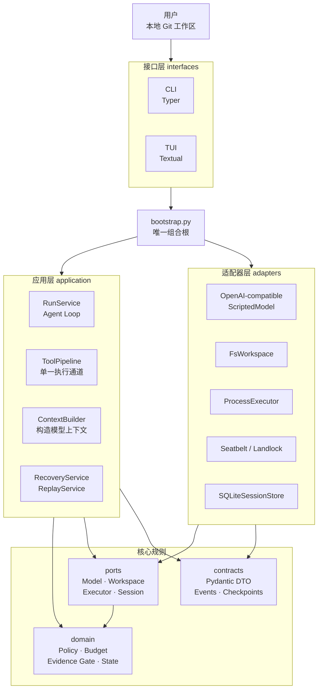
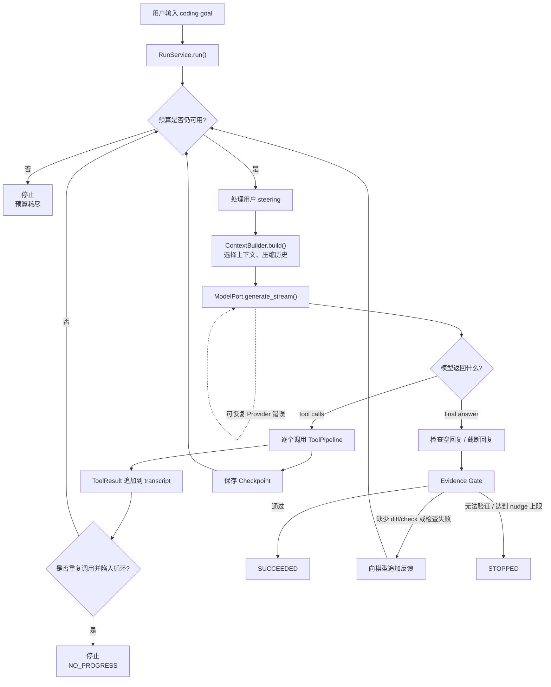
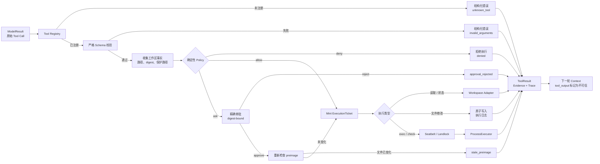
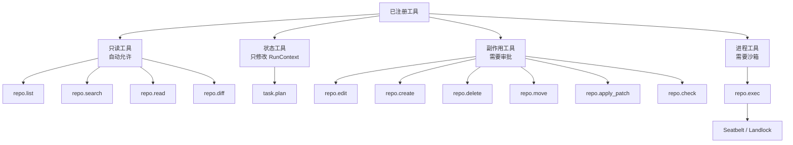
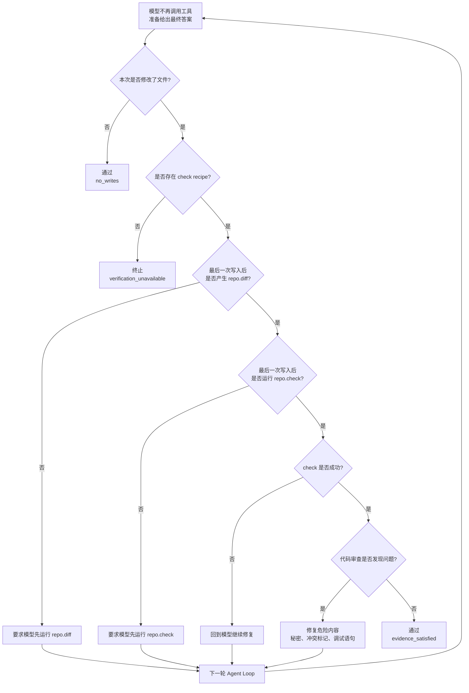
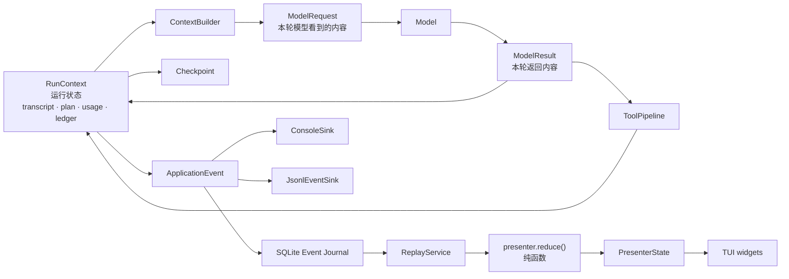
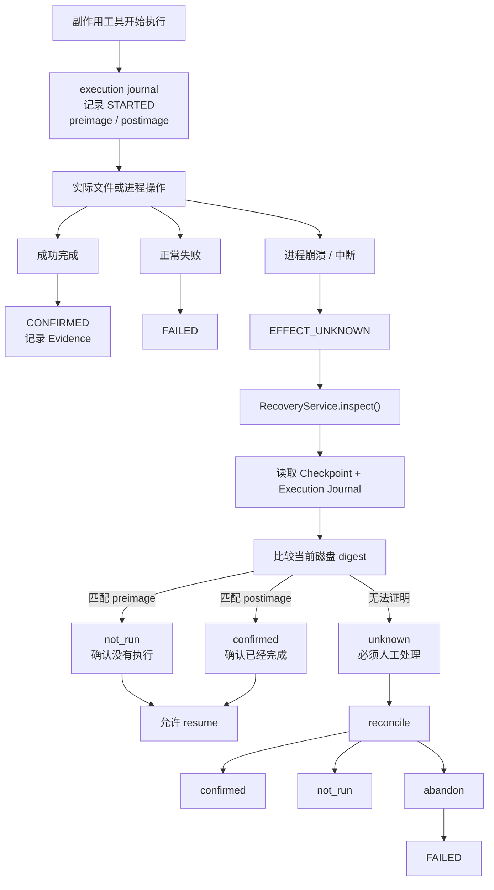

# Haven 项目学习图谱

[English](PROJECT_DIAGRAMS.en.md) | **中文**

这份文档用图的方式说明 Haven 的架构、运行流程、安全边界、证据门禁、持久化恢复和推荐学习路径。

Haven 可以先记成一句话：

> 模型负责提出建议，确定性程序负责权限、执行、记录、验证和停止。

图示以当前源码为准，主要参考：

- [`src/haven/bootstrap.py`](../src/haven/bootstrap.py)
- [`src/haven/application/run_service.py`](../src/haven/application/run_service.py)
- [`src/haven/application/tool_pipeline.py`](../src/haven/application/tool_pipeline.py)
- [`src/haven/domain/evidence.py`](../src/haven/domain/evidence.py)
- [`src/haven/application/context_builder.py`](../src/haven/application/context_builder.py)
- [`src/haven/adapters/sqlite_session.py`](../src/haven/adapters/sqlite_session.py)
- [`src/haven/application/recovery_service.py`](../src/haven/application/recovery_service.py)
- [`docs/ARCHITECTURE.md`](ARCHITECTURE.md)

## 1. 总体架构



关键理解：

- `domain/` 是最纯的业务规则，不能访问文件、数据库或网络。
- `application/` 编排业务流程，但不直接依赖具体适配器。
- `adapters/` 才真正访问模型、文件系统、进程、SQLite 和操作系统沙箱。
- `bootstrap.py` 负责把抽象接口和具体实现组装起来。
- `interfaces/` 只负责接收用户输入和展示结果。

## 2. 核心业务流程



一次正常的修改任务大致是：

```text
理解任务
  → 搜索文件
  → 阅读文件
  → 规划修改
  → 生成修改建议
  → 请求审批
  → 应用修改
  → 查看 diff
  → 执行测试
  → 根据失败结果继续修复
  → 通过 Evidence Gate
  → 结束运行
```

## 3. 单一工具执行通道

这是项目最重要的安全流程。



这里有一个关键原则：

> 执行器不接受模型的原始 JSON，只接受程序创建的 `ExecutionTicket`。

## 4. 工具分类



注意：

- `repo.exec` 的输出只是观察结果，不算测试证据。
- 只有注册过的 `repo.check` 才能用于验证修改。
- `read_only` 模式下，文件修改、检查和 `repo.exec` 都会被拒绝。
- 即使用户审批，也不能绕过路径越界、保护路径和沙箱缺失等硬拒绝。

## 5. Evidence Gate



写文件后的成功条件是：

```text
修改存在
  + 最后一次修改之后有 diff
  + 最后一次修改之后有 check
  + check 通过
  + diff 审查通过
```

所以模型说“我已经修好了”并不能让任务成功。

## 6. State、Context、ModelResult、Trace



四个概念：

| 概念 | 含义 |
| --- | --- |
| `State` | 运行过程中程序掌握的状态 |
| `Context` | 当前这一轮实际发送给模型的内容 |
| `ModelResult` | 模型刚刚返回的内容 |
| `Trace` | 程序记录下来的事件历史 |

特别重要的是：

- 历史工具输出进入 Context 时会被标记为不可信。
- 项目中的 `AGENTS.md` 也被当作不可信数据。
- 程序生成的 budget、digest、Evidence 等属于可信状态。
- TUI、CLI 和 Replay 都消费同一套事件流。

## 7. 持久化与崩溃恢复



SQLite 中主要保存：

```text
runs          运行摘要
events        追加式事件日志
checkpoints   快速恢复快照
approvals     digest 绑定的一次性审批
executions    副作用执行日志
artifacts     原始文件内容
```

恢复策略的核心是：

> 无法证明副作用是否完成时，绝不自动重放。

## 8. 推荐学习顺序

建议按下面顺序阅读，而不是一开始就从 TUI 开始：

1. [`README.md`](../README.md)：理解项目目标和核心保证。
2. [`bootstrap.py`](../src/haven/bootstrap.py)：看所有模块如何被组装。
3. [`run_service.py`](../src/haven/application/run_service.py)：理解 Agent Loop。
4. [`tool_pipeline.py`](../src/haven/application/tool_pipeline.py)：理解模型建议如何变成安全执行。
5. `domain/`：重点阅读 `policy.py`、`evidence.py`、`budget.py`、`transitions.py`、`approval.py`、`ticket.py`。
6. `ports/` 和 `adapters/`：理解依赖倒置和具体实现。
7. `events.py`、`emitter.py`、`sqlite_session.py`：理解事件、日志和恢复。
8. `interfaces/tui/`：最后理解界面如何消费事件，而不是自己执行逻辑。
9. [`course/00-from-scratch.md`](../course/00-from-scratch.md) 到 `course/capstone.md`：用课程材料系统复习。

推荐实际体验：

```bash
uv run haven eval --offline
uv run haven debug-context "fix the failing parser test"
uv run haven sessions list
uv run haven replay RUN_ID
```

最值得优先掌握的三个文件是：

```text
run_service.py       Agent 如何循环思考
tool_pipeline.py     Agent 如何被约束
evidence.py          程序如何判断任务是否真的成功
```
